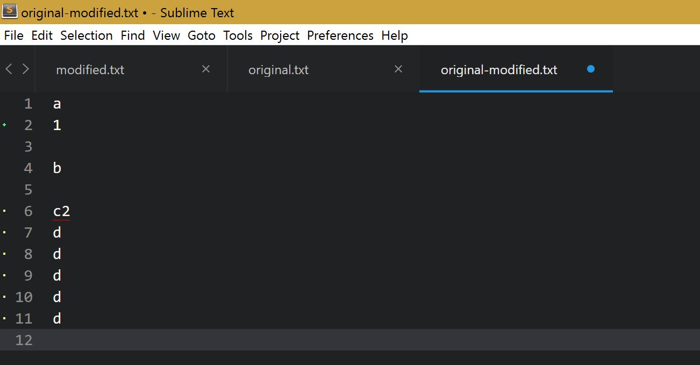
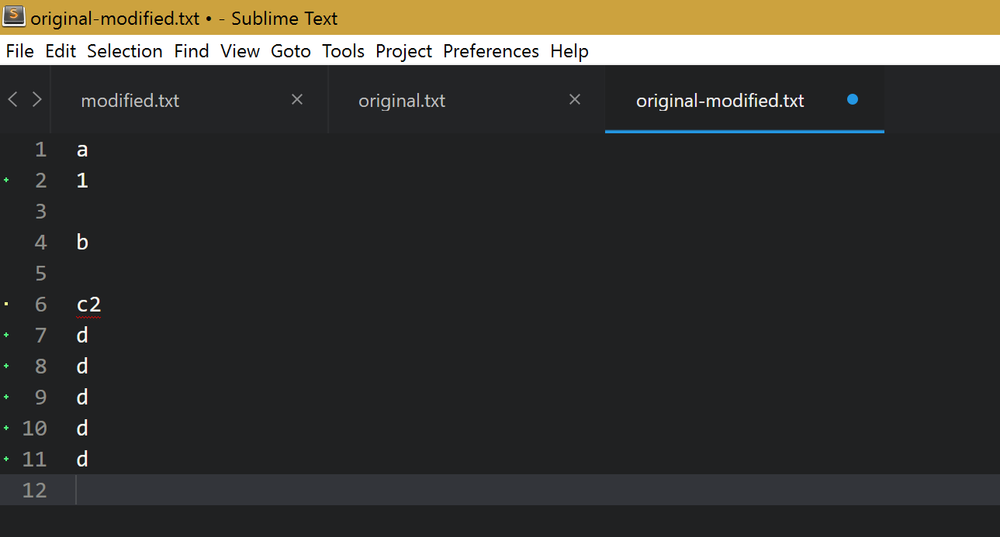
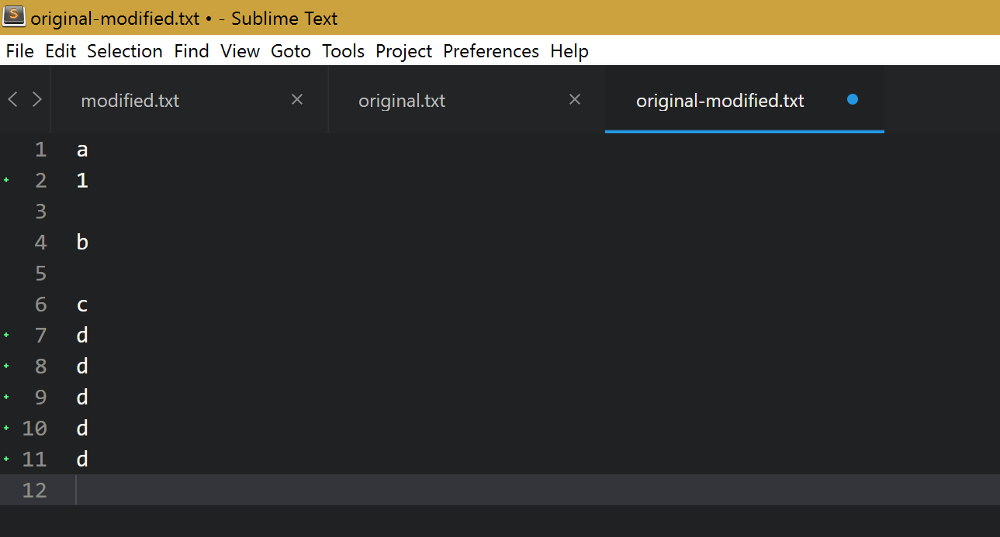

# gitgutter-bug-demonstration

This repo demonstrates a bug in the Sublime Text [GitGutter-Edge](https://packagecontrol.io/packages/GitGutter-Edge) package.

### The Problem

When lines are added directly after a line that is modified, all of the added lines are marked as modified.

### Demonstration

#### Steps

Open the `modified.txt` and `original-modified.txt` files in Sublime Text and copy the contents of `modified.txt` into `original-modified.txt`.

See how all of the `d` lines are marked as modified because the line above (`c2`) was modified.

Run `git diff`, which will show that all of the `d` lines are additions, not modifications.

Delete the `2` from the line with `c2` and notice that all of the `d` lines are now marked as additions.

#### Screenshots

##### Current behaviour

##### Expected behaviour

##### Current without first modified line

